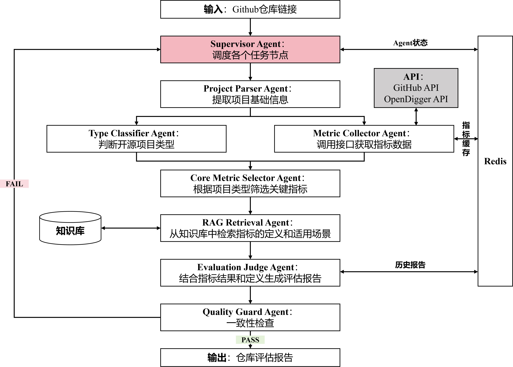

# 智能开源项目评估 Agent 系统

一个基于 **LangGraph + FastAPI + RAG + LLM + Redis** 的后端 AI 应用项目。

用户输入 GitHub 仓库链接后，系统会自动解析项目基础信息，采集 GitHub 与 OpenDigger 指标，根据项目类型筛选核心指标，结合本地知识库和 LLM 生成结构化开源项目评估报告，并通过 Quality Guard 对报告进行质量检查。

本项目定位为 AI 应用岗面试展示项目，重点体现：

- LangGraph 工作流编排
- GitHub / OpenDigger 外部 API 工具调用
- RAG 指标解释
- LLM 结构化报告生成
- Quality Guard 质量控制
- Redis 缓存、历史报告和任务状态管理
- 异常处理与降级兜底
- FastAPI 后端服务化

---

## 1. 项目背景

开发者在进行技术选型、项目调研或开源项目质量判断时，通常会参考 GitHub stars、forks、README 等信息。

但这些表层指标并不能完整反映一个开源项目的真实健康度。

例如：

- stars 高，不代表项目维护良好
- forks 多，不代表贡献活跃
- README 存在，不代表文档完整
- issue 多，可能代表社区活跃，也可能代表维护压力大
- 项目活跃，不代表社区结构健康

因此，本项目希望构建一个自动化开源项目评估系统，结合 GitHub API、OpenDigger 指标、RAG 知识解释和 LLM 报告生成，对开源项目进行更全面、更可解释的结构化评估。

---

## 2. 项目目标

系统目标是：

```text
输入 GitHub 仓库链接
→ 自动采集项目信息和开源健康度指标
→ 根据项目类型筛选关键指标
→ 检索指标定义和适用场景
→ 生成结构化评估报告
→ 进行质量检查
→ 返回可用于技术选型的项目评估结果
```

示例输入：

```json
{
  "url": "https://github.com/langchain-ai/langgraph",
  "use_cached_report": false
}
```

系统输出内容包括：

- 项目类型
- 总评分
- 五个维度评分
- 项目优势
- 项目风险
- 改进建议
- 核心指标
- 数据来源
- 质量检查结果
- 任务状态
- 历史报告缓存状态

---

## 3. 系统架构



系统主流程：

```text
输入 GitHub 仓库链接
→ Supervisor / LangGraph 调度
→ Project Parser
→ Type Classifier
→ Metric Collector
→ Core Metric Selector
→ RAG Retrieval
→ Rule Report Generator
→ LLM Report Agent
→ Quality Guard
→ 输出仓库评估报告
```

整体设计分为以下几层：

```text
API 层
→ FastAPI 对外提供接口

决策层
→ LangGraph + Supervisor 条件分支

工具层
→ GitHub API、OpenDigger API、Redis

规则型 Agent 层
→ 负责稳定、可控、确定性的处理逻辑

AI Agent 层
→ 调用 LLM 进行报告生成和复杂语义处理

知识库层
→ 存放指标定义、适用场景和局限性
```

---

## 4. 核心功能

### 4.1 GitHub 仓库解析

系统支持输入 GitHub 仓库地址，例如：

```text
https://github.com/langchain-ai/langgraph
```

解析得到：

```text
owner = langchain-ai
repo = langgraph
```

### 4.2 GitHub API 数据采集

系统调用 GitHub API 获取项目基础信息：

- stars
- forks
- open issues
- language
- topics
- license
- README

### 4.3 OpenDigger 指标采集

系统调用 OpenDigger 获取开源健康度指标：

- OpenRank
- Activity
- Contributors
- Bus Factor
- Issue Response Time
- Issue Resolution Duration
- Change Request Response Time

### 4.4 核心指标筛选

系统不会把所有原始指标直接交给 LLM，而是先根据项目类型筛选关键指标。

例如对于 AI Framework / Agent Framework，系统会优先选择：

- stars
- forks
- open issues
- license
- readme_exists
- openrank
- activity
- contributors
- bus_factor
- issue_response_time
- change_request_response_time

### 4.5 RAG 指标解释

当前版本实现了轻量 RAG：

```text
selected_metrics
→ 读取 knowledge_base/metrics.md
→ 根据指标名匹配对应章节
→ 写入 state.retrieved_context
→ LLM Report Agent 使用这些内容生成报告
```

后续计划升级为完全版 RAG：

```text
多文档知识库
→ 文档切分
→ 本地索引
→ 检索相关 chunk
→ 返回引用来源
→ LLM 使用检索结果生成报告
```

### 4.6 LLM 报告生成

系统先生成规则版 baseline 报告，再调用 LLM 基于以下内容生成最终结构化报告：

- GitHub 项目基础信息
- OpenDigger 核心指标
- RAG 检索到的指标解释
- 规则版报告

如果 LLM 调用失败，系统会保留规则版报告作为 fallback。

### 4.7 Quality Guard

Quality Guard 会检查报告是否满足基本质量要求，包括：

- overall_score 是否在 0-100
- dimension_scores 是否完整
- 每个维度分数是否在 0-20
- summary 是否存在
- strengths / risks / suggestions 是否为空
- data_sources 是否存在
- selected_metrics 是否存在

如果 Quality Guard 不通过，Supervisor 会尝试重新调用一次 LLM Report Agent。

### 4.8 Redis 支持

Redis 当前用于：

- 缓存 GitHub / OpenDigger 指标结果
- 保存历史评估报告
- 保存 task_id 对应的任务状态
- 支持 use_cached_report 快速返回历史报告

---

## 5. 技术栈

```text
Python 3.13
FastAPI
LangGraph
LangChain
DeepSeek / OpenAI-compatible API
Pydantic
Pydantic Settings
Redis
Docker Compose
httpx
uv
```

---

## 6. 项目结构

```text
app/
├── main.py
├── graph.py
├── schemas.py
├── config.py
├── tools/
│   ├── github_client.py
│   ├── opendigger_client.py
│   └── redis_store.py
├── agents/
│   ├── project_parser.py
│   ├── type_classifier.py
│   ├── metric_collector.py
│   ├── metric_selector.py
│   ├── rag_retrieval.py
│   ├── report_generator.py
│   ├── quality_guard.py
│   └── ai_agents/
│       └── llm_report_generator.py
├── prompts/
│   └── llm_report_prompt.md
knowledge_base/
└── metrics.md
docs/
├── architecture.md
├── modules.md
├── api.md
├── error_handling.md
├── performance.md
└── interview_story.md
docker-compose.yml
README.md
pyproject.toml
```

核心文件说明：

| 路径                             | 作用                                               |
| -------------------------------- | -------------------------------------------------- |
| `app/main.py`                    | FastAPI 后端入口，提供评估、任务状态、历史报告接口 |
| `app/graph.py`                   | LangGraph 工作流入口，包含 Supervisor 条件分支     |
| `app/schemas.py`                 | Pydantic 数据结构定义                              |
| `app/config.py`                  | 环境变量配置                                       |
| `app/tools/github_client.py`     | GitHub API 工具                                    |
| `app/tools/opendigger_client.py` | OpenDigger 指标工具                                |
| `app/tools/redis_store.py`       | Redis 存储工具                                     |
| `app/agents/`                    | 规则型 Agent / 工作流节点                          |
| `app/agents/ai_agents/`          | 调用 LLM 的 AI Agent                               |
| `app/prompts/`                   | Prompt 模板                                        |
| `knowledge_base/`                | 本地知识库                                         |
| `docs/`                          | 项目详细文档                                       |

---

## 7. 快速启动

### 7.1 安装依赖

```powershell
uv sync
```

### 7.2 配置环境变量

在项目根目录创建 `.env` 文件：

```env
GITHUB_TOKEN=your_github_token

LLM_PROVIDER=deepseek
MODEL_NAME=your_model_name
DEEPSEEK_API_KEY=your_deepseek_or_proxy_key
DEEPSEEK_BASE_URL=your_deepseek_or_proxy_base_url

REDIS_URL=redis://localhost:6379/0
```

注意：

```text
.env 不要提交到 GitHub。
```

### 7.3 启动 Redis

```powershell
docker compose up -d
```

### 7.4 启动 FastAPI

```powershell
uv run uvicorn app.main:app --reload
```

访问接口文档：

```text
http://127.0.0.1:8000/docs
```

---

## 8. API 快速示例

### 8.1 健康检查

```text
GET /health
```

返回：

```json
{
  "status": "ok"
}
```

### 8.2 执行仓库评估

```text
POST /evaluate
```

请求：

```json
{
  "url": "https://github.com/langchain-ai/langgraph",
  "use_cached_report": false
}
```

返回核心字段：

```json
{
  "task_id": "xxx",
  "status": "completed",
  "cache_hit": false,
  "owner": "langchain-ai",
  "repo": "langgraph",
  "project_type": "AI Framework / Agent Framework",
  "overall_score": 85,
  "summary": "...",
  "strengths": [],
  "risks": [],
  "suggestions": [],
  "quality_result": {
    "passed": true,
    "issues": [],
    "suggestions": []
  },
  "errors": []
}
```

### 8.3 使用历史报告缓存

```json
{
  "url": "https://github.com/langchain-ai/langgraph",
  "use_cached_report": true
}
```

如果 Redis 中已有历史报告，会返回：

```json
{
  "status": "completed",
  "cache_hit": true
}
```

### 8.4 查询任务状态

```text
GET /tasks/{task_id}
```

### 8.5 查询最近历史报告

```text
GET /reports/recent
```

### 8.6 查询指定仓库历史报告

```text
GET /reports/{owner}/{repo}
```

---

## 9. 异常处理

当前支持以下异常处理：

| 异常场景          | 处理策略                                                     |
| ----------------- | ------------------------------------------------------------ |
| 非法 GitHub URL   | 在 API 层直接返回 `invalid_github_url`                       |
| GitHub 仓库不存在 | 返回 `github_repo_not_found`                                 |
| LLM 生成报告失败  | 保留规则版报告作为 fallback                                  |
| Redis 不可用      | 主评估流程不崩溃，降级为无缓存、无历史报告、无任务状态持久化 |

示例：

```json
{
  "status": "failed",
  "error_type": "invalid_github_url",
  "message": "Invalid GitHub repository URL. Example: https://github.com/langchain-ai/langgraph"
}
```

详细说明见：

```text
docs/error_handling.md
```

---

## 10. 性能优化

已完成的性能优化：

- OpenDigger 指标从串行请求改为并发请求
- Redis 设置短超时，失败快速返回
- GitHub / OpenDigger 指标缓存
- 历史报告缓存快速返回

实测结果：

```text
Redis 停止 + 串行 OpenDigger：
平均约 218.82 秒

Redis 停止 + OpenDigger 并发请求：
约 85.50 秒

Redis 停止 + OpenDigger 并发 + Redis 快速失败：
约 41.42 秒

Redis 正常 + 指标缓存 + LLM 重新生成：
约 17.1 秒

Redis 正常 + use_cached_report=true：
约 0.03 秒
```

详细说明见：

```text
docs/performance.md
```

---

## 11. 当前完成度

已完成：

- GitHub 仓库链接解析
- GitHub API 数据采集
- OpenDigger 指标采集
- Redis 指标缓存
- Redis 历史报告保存
- Redis 任务状态保存
- LangGraph 工作流编排
- Supervisor 条件分支
- Quality Guard 失败重试一次
- 规则型项目分类
- 核心指标筛选
- 轻量 RAG 检索
- 规则版报告生成
- LLM 报告生成
- Quality Guard 质量检查
- LLM 失败规则报告兜底
- 非法 URL 异常处理
- GitHub 仓库不存在异常处理
- Redis 不可用降级
- 历史报告缓存快速返回
- API 返回结构优化

待完善：

—— 项目功能补全 ——

- [ ] 完全版 RAG：实现多文档知识库、文档切分、本地索引和相关内容检索
- [ ] Prompt 迭代说明：整理 LLM Report Prompt 从初版到最终版的优化过程
- [ ] 文档补全：完善 architecture、modules、api、error_handling、performance 文档

—— 项目功能增强 ——

- [ ] LLM Quality Reviewer：用 LLM 检查报告是否空泛、是否误读指标、是否缺少依据
- [ ] 风险诊断 risk_diagnosis：为每个风险补充证据、原因和建议
- [ ] 历史报告版本管理：保存同一仓库的多次评估结果，支持趋势分析
- [ ] 多轮追问：支持基于历史报告和指标上下文继续提问
- [ ] SSE 流式输出：实时展示任务进度
- [ ] 多仓库对比：支持多个开源项目横向比较
- [ ] 自动沉淀报告到知识库：将历史评估经验沉淀为后续 RAG 可用知识

—— 设计模式增强 ——

- [ ] ReAct 思想增强 RAG Retrieval：让检索过程支持“检索 → 观察 → 补充检索”的迭代流程
- [ ] ReAct 思想增强 LLM Quality Reviewer：让质量检查基于“检查报告 → 对照指标 → 判断是否有依据”
- [ ] 轻量 Plan-and-Executor：将 Supervisor 明确拆分为计划层和执行节点，用于多仓库对比或多轮追问

---

## 12. 项目亮点

### 12.1 规则节点和 AI Agent 分层

系统没有把所有任务都交给 LLM，而是将任务分成：

```text
规则型节点：
负责解析、采集、筛选、校验等稳定任务。

AI Agent：
负责复杂语义生成和自然语言报告。
```

这样可以降低幻觉风险，提高系统稳定性。

### 12.2 先规则报告，再 LLM 增强

系统不会让 LLM 从零生成报告，而是：

```text
先生成规则版 baseline 报告
→ 再让 LLM 基于真实指标和 RAG 内容优化报告
```

这样即使 LLM 失败，也可以返回规则版报告。

### 12.3 RAG 增强可解释性

LLM 报告不是只看指标值，而是结合知识库中对指标的解释，例如：

- OpenRank 为什么重要
- Bus Factor 有什么风险
- Issue Response Time 适合判断什么

这样报告更可解释。

### 12.4 Redis 提升工程完整度

Redis 不只是缓存工具，还用于：

- 指标缓存
- 历史报告
- 任务状态
- 缓存报告快速返回

体现了真实后端系统中的状态管理和性能优化意识。

### 12.5 Supervisor 条件分支

系统不是完全直线流程，而是具备基础 Supervisor 决策能力：

- 出错提前结束
- LLM 失败使用规则报告兜底
- Quality Guard 失败重试一次

---

## 13. Demo 流程

推荐演示顺序：

```text
1. 启动 Redis
2. 启动 FastAPI
3. 访问 /health
4. 调用 /evaluate 正常评估仓库
5. 展示 LLM + RAG 生成的报告
6. 展示 task_id
7. 查询 /tasks/{task_id}
8. 查询 /reports/recent
9. 查询 /reports/{owner}/{repo}
10. 使用 use_cached_report=true 展示毫秒级返回
11. 测试非法 URL 异常
12. 测试 GitHub 仓库不存在异常
13. 讲解 LLM 失败 fallback
14. 讲解 Redis 不可用降级
```

---

## 14. 文档导航

| 文档                      | 内容                                                    |
| ------------------------- | ------------------------------------------------------- |
| `docs/architecture.md`    | 系统架构、框架图、LangGraph 工作流、Supervisor 条件分支 |
| `docs/modules.md`         | 各模块、工具、规则型 Agent、AI Agent 的职责             |
| `docs/api.md`             | API 请求、返回结构和字段说明                            |
| `docs/error_handling.md`  | 异常处理和降级兜底策略                                  |
| `docs/performance.md`     | 性能优化记录和响应时间对比                              |
| `docs/interview_story.md` | 面试讲解稿和 Demo 讲解顺序                              |

---

## 15. 后续计划

### 15.1 完全版 RAG

计划升级为：

```text
多文档知识库
→ 文档切分
→ 本地索引
→ 检索相关 chunk
→ 返回来源
→ LLM 使用检索结果生成报告
```

### 15.2 LLM Quality Reviewer

当前 Quality Guard 是规则检查，后续计划增加 LLM 语义审查能力：

- 检查报告是否空泛
- 检查结论是否有指标依据
- 检查是否误读指标
- 检查是否存在自相矛盾

### 15.3 多仓库对比

后续可以支持：

```text
输入多个 GitHub 仓库
→ 统一采集指标
→ 横向比较评分
→ 生成技术选型建议
```

---

## 16. 总结

本项目是一个面向技术选型场景的后端 AI 应用系统，基于 LangGraph 编排 GitHub / OpenDigger 工具调用、RAG 指标解释、LLM 报告生成、Quality Guard 质量控制和 Redis 状态管理，实现对 GitHub 开源项目的自动化、可解释、结构化评估。